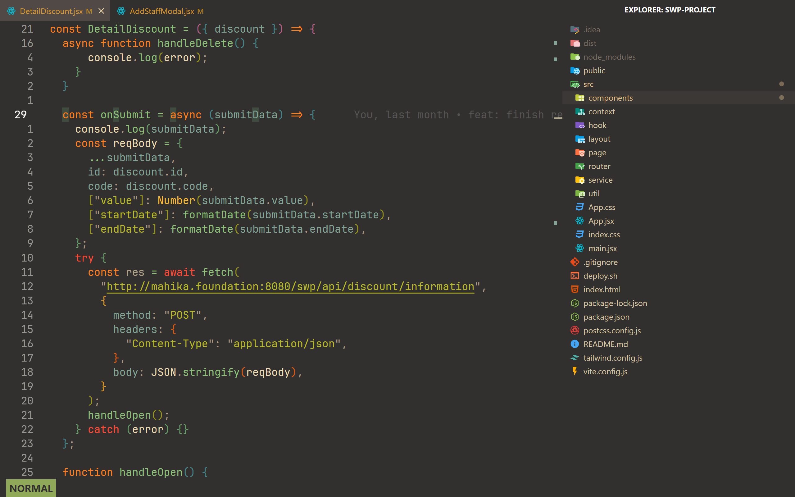

# My VScode settings & keybindings
## Extensions:
- Vim (Shout out to [ThePrimeagen](https://www.youtube.com/@ThePrimeagen))
- Apc Cusomize UI++
- Material Icon Theme
- Error lens

## Theme:
- Gruvbox Dark Soft

## Screenshot:

